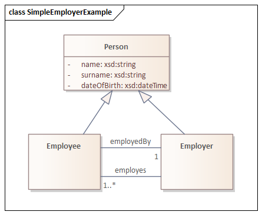

`uml2semantics` is an application that allows you to convert a UML class diagram to an OWL 2 ontology. Translating a UML 
class diagram to an OWL 2 ontology allows one to reason over the ontology and thereby discover possible 
inconsistencies or unintended consequences. The UML to OWL translation we use is based on
[UML to OWL](https://henrietteharmse.com/uml-vs-owl/uml-class-diagram-to-owl-and-sroiq-reference/), which
provides the related Manchester syntax and SROIQ semantics.


# Project status
`uml2semantics` is in the very early stages of development and thus is missing many features. Currently it has support 
for specifying classes and attributes/associations using TSV files.


# Assumption
This tool assumes that the UML class diagrams are conceptual models and as such they contain no implementation related 
details like interfaces, access modifiers or operations.

# Downloading
Download `uml2semantics.jar` from [latest release](https://github.com/henrietteharmse/uml2semantics/releases/latest).

# Quick Start
## Employer and Employee example 
As a quick start here is a small UML class diagram that we will convert to OWL. We define a `Person` class 
that has attributes `name`, `surname` and  `dateOfBirth`. The types we use are `name` and `surname` is `xsd:string` 
and for `dateOfBirth` we use `xsd:dateTime`. `Employee` and `Employer` extends `Person`. An employee has exactly 1 
employer and an employer has 1 or more employees.



### TSV representation
UML class diagram information can be specified using TSV files. First create
the TSV file for your classes. It has the following format:


| Curie | Name     | Definition | ParentNames | 
|-------|----------|------------|-------------|
|       | Person   |            |             |
|       | Employee |            | Person      |
|       | Employer |            | Person      |

Here we only specify the name for each class, hence the reason we used the **Name** column to define our classes. Since
`Employee` and `Employer` both extend the `Person` class, we add `Person` to **ParentNames** column. Multiple parents are
separated by `|`. Curie refer to compact URI based on the [W3C CURIE syntax](https://www.w3.org/TR/2010/NOTE-curie-20101216/).

If you want to make use of enumerations, specify them next. The format is as follows:

| Curie              | Name            | Definition                        |
|--------------------|-----------------|-----------------------------------|
| emp:SalarySchedule | PaymentSchedule | Defines the frequency of payments |

Again you can specify a curie and/or a name to refer to your enumeration. In this case we assume there
is a difference between the purl and the label of this concept. Definition allows you to describe this 
enumeration.

The values that an enumeration exists of, are specified in a different TSV with the following format:

| Enumeration      | Curie        | Name | 	Definition                                         |
|----------------------|--------------|------|--------------------------------------------------------|
| emp:SalarySchedule   | emp:Daily    |      | Employee gets paid at the end of each day              |
| PaymentSchedule      | Weekly       |      | Employee gets paid at the end of each week on a Friday |
| emp:SalarySchedule   | emp:Monthly  |      | Employee gets paid at the last day of the month        |

** Enumeration ** refers the name or curie of an enumeration. Each value of an enumeration can have a curie and/or a name
and a definition.

To specify attributes we use the following format. 

| Class    | Curie | Name        | ClassOrPrimitive | MinMultiplicity | MaxMultiplicity | Definition | 
|----------|-------|-------------|------------------|-----------------|-----------------|------------|
| Person   |       | name        | xsd:string       |                 |                 |            |
| Person   |       | surname     | xsd:string       |                 |                 |            |
| Person   |       | dateOfBirth | xsd:dateTime     |                 |                 |            |
| Employee |       | employedBy  | Employer         | 1               | 1               |            |
| Employer |       | employes    | Employee         | 1               | *               |            |

**Class** refers to the class for which we are defining the attributes. Attributes can also be defined using curies, 
but we again only used names for now. The type of an attribute can be a primitive or a class. Currenlty XML primitive data
types used in [Protege Desktop](https://protege.stanford.edu/) as data types are supported. When no multiplicity is given,
[1..1] is assumed. `*` is to refer to infinite as per usual.

A Google spreadsheet for this UML class diagram can be found [here](https://docs.google.com/spreadsheets/d/1FXpbc52Ag24Htj3Qq36Z743QB5SzlShzjeg98uxd2Xo/edit?usp=sharing).
Save the classes and attributes tabs as TSV files.

### Run uml2semantics
Assuming you have download uml2semantics to a`$uml2semantics` directory and saved the .tsv files to this directory as well,
you can run it as follows:

```

java -jar uml2semantics.jar \ 
-c "$uml2semantics/Employer - Classes.tsv" \
-a "$uml2semantics/Employer - Attributes.tsv" \
-e "$uml2semantics/Employer - Enumerations.tsv" \
-n "$uml2semantics/Employer - EnumerationNamedValues.tsv" \
-o "$uml2semantics/employer.rdf" \
-p "emp:http://uml2semantics.org/examples/employer#" \
-i "http://uml2semantics.org/examples/employer/v.0.1" 

```

This will cause the ontology to be written out to `$uml2semantics/employer.owl`. An example of this file can be seen 
[here](./examples/employer/employer.rdf)

## DCAT version 2 Example
Initial DCAT version 2 example is defined [here](./examples/dcat2/README.md). 


