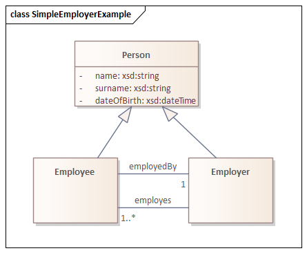
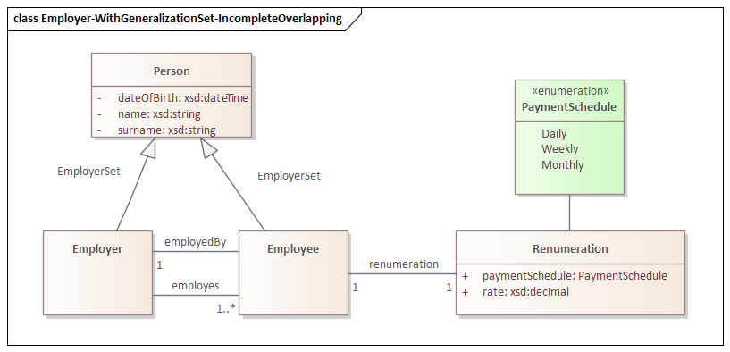

`uml2semantics` is an application that allows you to convert a UML class diagram to an OWL 2 ontology. Translating a UML 
class diagram to an OWL 2 ontology allows one to reason over the ontology and thereby discover possible 
inconsistencies or unintended consequences. The UML to OWL translation we use is based on
[UML to OWL](https://henrietteharmse.com/uml-vs-owl/uml-class-diagram-to-owl-and-sroiq-reference/), which
provides the related Manchester syntax and SROIQ semantics.


# Project status
`uml2semantics` is in the very early stages of development and thus is missing many features. Currently it has support 
for specifying classes and attributes/associations using TSV files.


# Assumption
This tool assumes that the UML class diagrams are conceptual models and as such they contain no implementation related 
details like interfaces, access modifiers or operations.

# Downloading
Download `uml2semantics.jar` from [latest release](https://github.com/henrietteharmse/uml2semantics/releases/latest).

# Java Version 
Java 11+

# Command Line Parameters

| Short | Long | Required | Description |
|-------|------|----------|-------------|
| `-c` | `--classes` | No | TSV file containing UML class information |
| `-a` | `--attributes` | No | TSV file containing UML class attribute information |
| `-m` | `--xmi` | No | An XMI file exported from a UML tool |
| `-o` | `--ontology` | **Yes** | Output OWL ontology file |
| `-i` | `--ontologyIRI` | **Yes** | IRI of the ontology (e.g., `https://example.com/ontology`) |
| `-p` | `--ontologyPrefix` | **Yes** | Prefix for the ontology (e.g., `ex:https://example.com/ontology/`) |
| `-x` | `--prefixes` | No | Comma-separated list of additional prefixes (`name:uri,...`) |
|  | `--overrides` | No | When both XMI and TSV are provided: `TSV` (default) or `XMI`. Indicates which source takes precedence. |

At minimum, you must provide either TSV files (`-c`, `-a`, `-e`, `-n`) or an XMI file (`-m`) as input, along with the three required options (`-o`, `-i`, `-p`).

# Quick Start
## Employer and Employee example 
As a quick start here is a small UML class diagram that we will convert to OWL. We define a `Person` class 
that has attributes `name`, `surname` and  `dateOfBirth`. The types we use are `name` and `surname` is `xsd:string` 
and for `dateOfBirth` we use `xsd:dateTime`. `Employee` and `Employer` extends `Person`. An employee has exactly 1 
employer and an employer has 1 or more employees.



### TSV representation
UML class diagram information can be specified using TSV files. First create
the TSV file for your classes. It has the following format:


| Curie | Name     | Definition | ParentNames | 
|-------|----------|------------|-------------|
|       | Person   |            |             |
|       | Employee |            | Person      |
|       | Employer |            | Person      |

Here we only specify the name for each class, hence the reason we used the **Name** column to define our classes. Since
`Employee` and `Employer` both extend the `Person` class, we add `Person` to **ParentNames** column. Multiple parents are
separated by `|`. Curie refer to compact URI based on the [W3C CURIE syntax](https://www.w3.org/TR/2010/NOTE-curie-20101216/).

To specify attributes we use the following format. 

| Class    | Curie | Name        | ClassEnumOrPrimitiveType | MinMultiplicity | MaxMultiplicity | Definition | 
|----------|-------|-------------|--------------------------|-----------------|-----------------|------------|
| Person   |       | name        | xsd:string               |                 |                 |            |
| Person   |       | surname     | xsd:string               |                 |                 |            |
| Person   |       | dateOfBirth | xsd:dateTime             |                 |                 |            |
| Employee |       | employedBy  | Employer                 | 1               | 1               |            |
| Employer |       | employes    | Employee                 | 1               | *               |            |

**Class** refers to the class for which we are defining the attributes. Attributes can also be defined using curies, 
but we again only used names for now. The type of an attribute can be a primitive or a class. Currenlty XML primitive data
types as used in [Protege Desktop](https://protege.stanford.edu/) data types are supported. When no multiplicity is given,
[1..1] is assumed. `*` is to refer to infinite as per usual.

A Google spreadsheet for this UML class diagram can be found [here](https://docs.google.com/spreadsheets/d/1FXpbc52Ag24Htj3Qq36Z743QB5SzlShzjeg98uxd2Xo/edit?usp=sharing).
Save the classes and attributes tabs as TSV files.

### Run uml2semantics using TSV files
Assuming you have downloaded uml2semantics to a `$uml2semantics` directory (you need to replace `$uml2semantics` with your 
directory name), the following will generate the employer ontology for the Employer example in `$uml2semantics/examples/employer/`
as `$uml2semantics/examples/employer/employer.rdf`:

```
java -jar uml2semantics.jar \
-c "$uml2semantics/examples/employer/Employer - Classes.tsv" \
-a "$uml2semantics/examples/employer/Employer - Attributes.tsv" \
-o "$uml2semantics/examples/employer/employer.rdf" \
-p "emp:http://uml2semantics.org/examples/employer#" \
-i "http://uml2semantics.org/examples/employer/v.0.1" 
```

### Run uml2semantics using XMI file
Consider this example .
Note: Currently enumerations are not read from XMI as yet.

Assuming your in the `$uml2semantics` directory where you have cloned uml2semantics and downloaded the uml2semantics.jar,
you can read the example XMI as generated by Enterprise Architect using the following:

```
java -jar uml2semantics.jar \
-m "./examples/xmi/sparx/Employer-WithGeneralizationSet-CompleteOverlapping.xml" \
-o "./uml2semantics/examples/xmi/sparx/Employer-WithGeneralizationSet-CompleteOverlapping.rdf" \
-p "emp:http://uml2semantics.org/examples/employer#" \
-i "http://uml2semantics.org/examples/employer/v.0.1" 

```
This writes the ontology to `./uml2semantics/examples/xmi/sparx/Employer-WithGeneralizationSet-CompleteOverlapping.rdf`.


# Run uml2semantics using XMI and TSV files
You can provide both TSV and XMI input together. Use the `--overrides` option to control which source
takes precedence when both define the same class or attribute. The default is `TSV`, meaning TSV values
override XMI values.

```
java -jar uml2semantics.jar \
-m "./examples/xmi/sparx/Employer-WithGeneralizationSet-CompleteOverlapping.xml" \
-c "./examples/xmi/sparx/Employer - Classes.tsv" \
-a "./examples/xmi/sparx/Employer - Attributes.tsv" \
--overrides TSV \
-o "./uml2semantics/examples/xmi/sparx/Employer-WithGeneralizationSet-CompleteOverlapping-TSVOverride.rdf" \
-p "emp:http://uml2semantics.org/examples/employer#" \
-i "http://uml2semantics.org/examples/employer/v.0.1" 
```

The resulting ontology is written to `./uml2semantics/examples/xmi/sparx/Employer-WithGeneralizationSet-CompleteOverlapping-TSVOverride.rdf`.
Due to the use of the override, instead of having `http://uml2semantics.org/examples/employer#Person` as the IRI of the 
Person class, it is now `http://schema.org/Person`. We can do something similar for the name attribute of Person where 
we may want to rather make use Schema.org's givenName. This is of use where existing UML class diagrams need to be integrated with 
linked data. Such overrides are not limited to curies only. It can be anything that can be specified via TSV and could 
include additional classes and attributes.

## DCAT version 2 Example
Initial DCAT version 2 example is defined [here](./examples/dcat2/README.md). 


