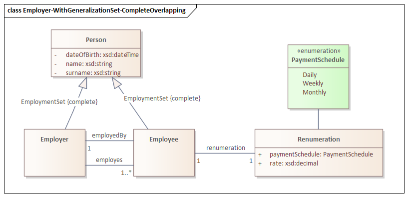

# uml2semantics v0.0.3: XMI Support for UML-to-OWL Conversion

## Introduction

[uml2semantics](https://github.com/henrietteharmse/uml2semantics) converts UML class diagrams into OWL 2 ontologies, enabling you to reason over your conceptual 
models and discover inconsistencies or unintended consequences. The UML-to-OWL translation is based on [UML to OWL](https://henrietteharmse.com/uml-vs-owl/uml-class-diagram-to-owl-and-sroiq-reference/), 
which provides the related Manchester syntax and SROIQ semantics.


uml2semantics v0.0.3 now supports reading of XMI files. Previously, users had to manually create TSV files to 
describe their classes and attributes. With XMI support, you can now export your UML class diagram directly from a modelling 
tool like Enterprise Architect and feed it straight into uml2semantics.

Why does XMI matter? Many organisations already maintain UML class diagrams in modelling tools, such as Sparx Enterprise Architect, 
representing the core entities of their enterprise data. To make their data Findable, Accessible, Interoperable and Reusable 
([FAIR](https://www.nature.com/articles/sdata201618)), and AI-Ready,
being able to describe their data by ontologies, is an essential step. 

## Getting Started

1. **Download** `uml2semantics.jar` from the [latest release](https://github.com/henrietteharmse/uml2semantics/releases/latest)
2. **Requires** Java 11+
3. **Run** with your XMI file:
   ```
   java -jar uml2semantics.jar \
   -m "your-model.xml" \
   -o "output.rdf" \
   -p "prefix:http://your-ontology-iri#" \
   -i "http://your-ontology-iri/v1"
   ```

See the [README](https://github.com/henrietteharmse/uml2semantics?tab=readme-ov-file#command-line-parameters) for the full CLI parameter reference and additional examples.

## Example: Generating OWL from an XMI File

Consider the following UML class diagram, which includes a generalization set with Complete and Overlapping constraints:



In this diagram, `Person` is the superclass of `Employee` and `Employer`, with a generalization set marked as `{complete, overlapping}`. This means every `Person` is at least either an `Employee` or an `Employer` (complete), but it is also possible that `Person` are both (overlapping).

To convert this XMI file to an OWL ontology, run:

```
java -jar uml2semantics.jar \
-m "./examples/xmi/sparx/Employer-WithGeneralizationSet-CompleteOverlapping.xml" \
-o "./uml2semantics/examples/xmi/sparx/Employer-WithGeneralizationSet-CompleteOverlapping.rdf" \
-p "emp:http://uml2semantics.org/examples/employer#" \
-i "http://uml2semantics.org/examples/employer/v.0.1"
```

This produces an OWL ontology at the specified output path. Because the generalization set is Complete and Overlapping, 
uml2semantics generates an `owl:equivalentClass` axiom stating that `Person` is equivalent to the union of `Employee` and `Employer`.


## Example: Combining TSV and XMI with TSV Override

A feature of uml2semantics is the ability to combine XMI and TSV inputs using the `--overrides` option. This is 
particularly useful when you want to integrate your UML model with existing linked data vocabularies, such as [Schema.org](https://schema.org/).

For instance, suppose you want the `Person` class in your ontology to use the Schema.org IRI `http://schema.org/Person`, 
instead of the auto-generated `http://uml2semantics.org/examples/employer#Person`. You can achieve this with a TSV override 
file for classes:

**Employer - Classes.tsv:**

| Curie | Name | Definition | ParentNames |
|-------|------|------------|-------------|
| schema:Person | Person | | |

Similarly, you can map attributes to Schema.org properties. The following TSV override maps the `name` attribute to 
`schema:givenName` and `surname` to `schema:familyName`:

**Employer - Attributes.tsv:**

| Class | Curie | Name | ClassEnumOrPrimitiveType | MinMultiplicity | MaxMultiplicity | Definition |
|-------|-------|------|--------------------------|-----------------|-----------------|------------|
| Person | schema:givenName | name | xsd:string | | | |
| Person | schema:familyName | surname | xsd:string | | | |

Now run uml2semantics with both the XMI file and the TSV overrides:

```
java -jar uml2semantics.jar \
-m "./examples/xmi/sparx/Employer-WithGeneralizationSet-CompleteOverlapping.xml" \
-c "./examples/xmi/sparx/Employer - Classes.tsv" \
-a "./examples/xmi/sparx/Employer - Attributes.tsv" \
--overrides TSV \
-o "./uml2semantics/examples/xmi/sparx/Employer-WithGeneralizationSet-CompleteOverlapping-TSVOverride.rdf" \
-p "emp:http://uml2semantics.org/examples/employer#" \
-i "http://uml2semantics.org/examples/employer/v.0.1"
```

The result: the `Person` class now has the IRI `http://schema.org/Person`, and its `name` and `surname` attributes use 
`schema:givenName` and `schema:familyName` respectively. The rest of the model -- the generalization set, associations, 
and other classes -- comes from the XMI file as before.

This approach is valuable when integrating existing UML class diagrams with linked data. Overrides are not limited to 
CURIEs -- you can add entirely new classes and attributes via TSV that don't exist in the XMI.


## What XMI Features Are Supported

uml2semantics can read the following UML constructs from XMI files:

- **Classes with attributes** -- including name, type, and multiplicity
- **Generalizations** (inheritance) -- subclass/superclass relationships
- **Generalization sets** with all four constraint combinations:
    - **Complete + Disjoint** -- translated to `owl:DisjointUnion`
    - **Complete + Overlapping** -- translated to `owl:equivalentClass` with `owl:unionOf`
    - **Incomplete + Disjoint** -- translated to `owl:AllDisjointClasses`
    - **Incomplete + Overlapping** -- translated to subclass relationships only
- **Associations between classes** -- translated to OWL object properties

Note: enumerations are not yet supported.

## Conclusion
If uml2semantics is of interest to you, please let me know:
1. What features will you like to see in this tool?
2. If you are using a different modelling tool, it will be very helpful if you can provide an example XMI export and image of 
your UML class diagram. XMI is supposed to be standard, but as we all know, standards are made to be broken :-).

